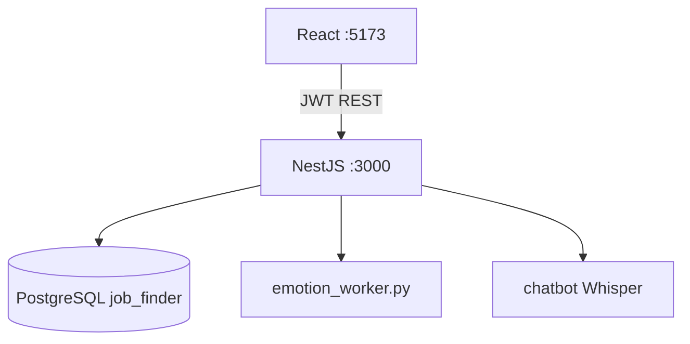

# README Final — Plateforme PFE Job Finder

Guide complet pour **cloner**, **installer PostgreSQL**, **configurer** et **lancer** le projet sur un autre PC (Windows).  
Dépôt GitHub : **https://github.com/DaEses/pfe_final**

Les **modèles IA** et le **dataset** (`binary_data`, `.h5`, `.pt`, `face_landmarker.task`) sont déjà dans le repo — pas besoin de les retélécharger après le clone.

---

## Sommaire

0. [**Guide rapide — nouveau PC (checklist)**](#0-guide-rapide--nouveau-pc-checklist)
1. [Vue d'ensemble](#1-vue-densemble)
2. [Architecture](#2-architecture)
3. [Structure du dépôt](#3-structure-du-dépôt)
4. [Prérequis](#4-prérequis)
5. [Installation détaillée](#5-installation-détaillée)
6. [Base de données PostgreSQL](#6-base-de-données-postgresql)
7. [Variables d'environnement](#7-variables-denvironnement)
8. [Démarrage des services](#8-démarrage-des-services)
9. [Vérification que tout fonctionne](#9-vérification-que-tout-fonctionne)
10. [Flux métier](#10-flux-métier)
11. [API principale](#11-api-principale)
12. [Modules Python (IA)](#12-modules-python-ia)
13. [Dépannage](#13-dépannage)

---

## 0. Guide rapide — nouveau PC (checklist)

Suivre les étapes **dans l'ordre**. Cocher au fur et à mesure.

| # | Étape | Commande / action |
|---|--------|-------------------|
| 1 | Installer Node.js 18+, Python 3.10+, PostgreSQL 13+, Git | Voir [§4 Prérequis](#4-prérequis) |
| 2 | Cloner le projet | `git clone https://github.com/DaEses/pfe_final.git` puis `cd pfe_final` |
| 3 | Installer PostgreSQL et noter port / mot de passe | [§6 Base de données](#6-base-de-données-postgresql) |
| 4 | Créer la base `job_finder` | `psql` + `CREATE DATABASE job_finder;` ou pgAdmin |
| 5 | Configurer le backend `.env` | `copy .env.example .env` + adapter `DB_PORT` / `DB_PASSWORD` |
| 6 | Configurer le frontend `.env` | `copy .env.example .env` |
| 7 | `npm install` backend + frontend | [§5.2–5.3](#52-backend-nestjs) |
| 8 | Créer les 2 venv Python + `pip install` | [§5.4](#54-environnements-python-obligatoire) |
| 9 | Vérifier modèles présents | `face_landmarker.task`, `binary_emotion_model.h5`, `yolov8n.pt` |
| 10 | Démarrer PostgreSQL → backend → frontend | [§8](#8-démarrage-des-services) ou `.\start-all.ps1` |
| 11 | Tester dans le navigateur | [§9](#9-vérification-que-tout-fonctionne) |

**URLs une fois démarré**

| Service | URL |
|---------|-----|
| Frontend | http://localhost:5173 |
| API | http://localhost:3000/api |
| PostgreSQL | `localhost` + port de votre `.env` (8080 ou 5432) |

---

## 1. Vue d'ensemble

| Composant | Technologie | Port |
|-----------|-------------|------|
| Frontend HR + Candidat | React 18 + Vite | **5173** |
| Backend API | NestJS + TypeORM | **3000** (`/api`) |
| Base de données | PostgreSQL | **8080** ou **5432** |
| Chatbot | Python + Whisper | via backend |
| Emotion / gaze / phone | Python + Keras + MediaPipe + YOLO | via backend |

Installation locale **sans Docker** (Windows + PowerShell recommandé).

---

## 2. Architecture



**Entretien candidat** : caméra navigateur → frames vers l'API → worker Python (gaze, émotion, téléphone) → rapport HR.

---

## 3. Structure du dépôt

```
pfe_final/                    (racine après clone)
├── README.md
├── README_FINAL.md           ← ce guide
├── start-all.ps1             ← lance PG + backend + frontend (Windows)
├── stop-all.ps1
├── scripts/init-database.sql
├── face_landmarker.task      ← inclus dans Git
├── plateform/jobfinderportal-master/
│   ├── job-finder-backend/
│   └── job-finder-frontend/
├── chatbot/
├── emotiondetection/
│   ├── binary_data/          ← dataset inclus dans Git
│   └── models/
│       ├── binary_emotion_model.h5
│       ├── yolov8n.pt
│       └── emotion_worker.py
```

**Non versionnés** (à recréer sur chaque PC) : `node_modules/`, `.venv/`, fichiers `.env`.

---

## 4. Prérequis

Installer **avant** de lancer le projet :

| Outil | Version | Lien / notes |
|-------|---------|--------------|
| **Git** | récent | https://git-scm.com |
| **Node.js** | 18 ou 20 LTS | https://nodejs.org |
| **npm** | 9+ | inclus avec Node |
| **Python** | 3.10 ou 3.11 | https://www.python.org — cocher *Add to PATH* |
| **PostgreSQL** | 13+ (16/17/18 OK) | https://www.postgresql.org/download/windows/ |
| **Webcam + micro** | — | Entretien candidat |

Optionnel : **Ollama** uniquement pour tester `chatbot/hr_interview.py` en mode interactif.

**Espace disque** : ~2–3 Go (clone + `node_modules` + venv Python).

---

## 5. Installation détaillée

### 5.1 Cloner le dépôt

```powershell
git clone https://github.com/DaEses/pfe_final.git
cd pfe_final
```

> Si le dossier s'appelle autrement après clone, adapter les chemins (`cd` vers la racine qui contient `start-all.ps1`).

### 5.2 Backend (NestJS)

```powershell
cd plateform\jobfinderportal-master\job-finder-backend
npm install --legacy-peer-deps
copy .env.example .env
notepad .env
```

Dans `.env`, vérifier **obligatoirement** :

- `DB_HOST`, `DB_PORT`, `DB_USERNAME`, `DB_PASSWORD`, `DB_NAME`
- `JWT_SECRET` (valeur quelconque en local)
- `NODE_ENV=development`

### 5.3 Frontend (React)

```powershell
cd ..\job-finder-frontend
npm install
copy .env.example .env
```

Le fichier `.env` doit contenir :

```env
VITE_API_BASE_URL=http://localhost:3000/api
```

### 5.4 Environnements Python (obligatoire)

Le backend appelle ces interpréteurs :

- `chatbot\.venv\Scripts\python.exe`
- `emotiondetection\.venv\Scripts\python.exe`

**Chatbot**

```powershell
cd <racine-projet>\chatbot
python -m venv .venv
.\.venv\Scripts\Activate.ps1
python -m pip install --upgrade pip
pip install -r requirements.txt
deactivate
```

**Emotion detection**

```powershell
cd <racine-projet>\emotiondetection
python -m venv .venv
.\.venv\Scripts\Activate.ps1
python -m pip install --upgrade pip
pip install -r requirements.txt
deactivate
```

> La première installation Python peut prendre **10–20 minutes** (TensorFlow, OpenCV, MediaPipe, etc.).

### 5.5 Modèles et dataset (déjà dans Git)

Vérifier après clone :

```powershell
cd <racine-projet>
Test-Path face_landmarker.task
Test-Path emotiondetection\models\binary_emotion_model.h5
Test-Path emotiondetection\models\yolov8n.pt
Test-Path emotiondetection\binary_data
```

Tous doivent retourner `True`. Sinon : `git pull` ou re-cloner.

---

## 6. Base de données PostgreSQL

### 6.1 Installer PostgreSQL (nouveau PC)

1. Télécharger l'installateur Windows PostgreSQL.
2. Pendant l'installation :
   - Noter le **mot de passe** du super-utilisateur `postgres`.
   - Port par défaut souvent **5432** (vous pouvez garder 5432 ou utiliser **8080** comme sur la machine de dev — l'important est d'aligner `DB_PORT` dans `.env`).
3. Laisser cocher l'installation de **pgAdmin** (utile pour créer la base visuellement).

### 6.2 Démarrer le service PostgreSQL

**Services Windows**

- `Win + R` → `services.msc` → service **postgresql-x64-…** → **Démarrer** → Démarrage automatique.

**Ou PowerShell (admin)** :

```powershell
Get-Service -Name *postgres* | Start-Service
```

### 6.3 Créer la base `job_finder`

#### Option A — Ligne de commande `psql`

Remplacer `8080` par `5432` si c'est votre port PostgreSQL.

```powershell
# Connexion (mot de passe demandé)
psql -U postgres -h localhost -p 8080

# Dans psql :
CREATE DATABASE job_finder;
\l
\q
```

Script fourni :

```powershell
cd <racine-projet>
psql -U postgres -h localhost -p 8080 -f scripts\init-database.sql
```

#### Option B — pgAdmin

1. Ouvrir pgAdmin → se connecter au serveur local.
2. Clic droit **Databases** → **Create** → **Database**.
3. Nom : **`job_finder`** → Save.

### 6.4 Tables (automatique)

Avec `NODE_ENV=development`, TypeORM **`synchronize: true`** crée toutes les tables au **premier démarrage réussi** du backend.

Vous n'avez **pas** de script SQL de tables à exécuter manuellement.

### 6.5 Aligner le backend avec votre PostgreSQL

Fichier : `plateform/jobfinderportal-master/job-finder-backend/.env`

| Variable | Exemple machine dev | Exemple install standard |
|----------|---------------------|---------------------------|
| `DB_HOST` | `localhost` | `localhost` |
| `DB_PORT` | `8080` | `5432` |
| `DB_USERNAME` | `postgres` | `postgres` |
| `DB_PASSWORD` | `123` | *votre mot de passe install* |
| `DB_NAME` | `job_finder` | `job_finder` |

**Test de connexion**

```powershell
psql -U postgres -h localhost -p 5432 -d job_finder -c "SELECT 1;"
```

Si erreur `database does not exist` → refaire l'étape 6.3.  
Si erreur `password authentication failed` → corriger `DB_PASSWORD` dans `.env`.

### 6.6 PostgreSQL sur port 8080 (optionnel, comme la machine de dev)

Si vous voulez reproduire exactement le port **8080** :

- Soit configurer PostgreSQL pour écouter sur 8080 (fichier `postgresql.conf` : `port = 8080`),
- Soit garder **5432** et mettre `DB_PORT=5432` dans `.env` (recommandé sur un nouveau PC).

Le script `start-all.ps1` tente de lancer Postgres 18 sur 8080 avec un chemin fixe — **à adapter** si votre version/chemin diffère (voir §8).

---

## 7. Variables d'environnement

### Backend — `job-finder-backend/.env`

```env
DB_HOST=localhost
DB_PORT=5432
DB_USERNAME=postgres
DB_PASSWORD=VOTRE_MOT_DE_PASSE
DB_NAME=job_finder
JWT_SECRET=local_dev_change_me
PORT=3000
NODE_ENV=development
```

> Copier depuis `.env.example` puis modifier `DB_PASSWORD` et `DB_PORT`.

### Frontend — `job-finder-frontend/.env`

```env
VITE_API_BASE_URL=http://localhost:3000/api
```

### Fichiers sensibles

Ne **jamais** committer `.env` (déjà dans `.gitignore`). Chaque développeur crée le sien depuis `.env.example`.

---

## 8. Démarrage des services

### Ordre recommandé

1. **PostgreSQL** (service démarré + base `job_finder` créée)
2. **Backend** NestJS
3. **Frontend** Vite

### Méthode A — Script automatique (Windows)

À la **racine** du projet (`pfe_final`) :

```powershell
.\start-all.ps1
```

- Ouvre des fenêtres PowerShell pour backend et frontend.
- Tente de lancer PostgreSQL sur le port **8080** si rien n'écoute (chemin par défaut : `C:\Program Files\PostgreSQL\18\...`).

**Si PostgreSQL est déjà sur 5432** : démarrer le service Windows, mettre `DB_PORT=5432` dans `.env`, et lancer backend/frontend manuellement (méthode B).

### Méthode B — Manuelle (recommandée sur nouveau PC)

**Terminal 1 — Vérifier PostgreSQL**

```powershell
psql -U postgres -h localhost -p 5432 -d job_finder -c "SELECT version();"
```

**Terminal 2 — Backend**

```powershell
cd plateform\jobfinderportal-master\job-finder-backend
# Adapter le port si besoin :
$env:DB_PORT = "5432"
npm run start:dev
```

Attendre le message : `Nest application successfully started`.

**Terminal 3 — Frontend**

```powershell
cd plateform\jobfinderportal-master\job-finder-frontend
npm run dev
```

### Libérer le port 3000 si occupé

```powershell
Get-NetTCPConnection -LocalPort 3000 -State Listen -ErrorAction SilentlyContinue |
  ForEach-Object { Stop-Process -Id $_.OwningProcess -Force }
```

### Arrêter les services

```powershell
.\stop-all.ps1
```

(Fermer aussi les fenêtres PowerShell ou `Ctrl+C` dans chaque terminal.)

---

## 9. Vérification que tout fonctionne

### 9.1 API

```powershell
curl http://localhost:3000/api/jobs
```

Réponse JSON (éventuellement `[]`) = backend OK.

### 9.2 Frontend

Ouvrir http://localhost:5173 — la page d'accueil s'affiche.

### 9.3 Base de données

Après démarrage backend, dans pgAdmin ou psql :

```sql
\c job_finder
\dt
```

Vous devez voir des tables (`users`, `job_postings`, `applications`, `job_applications`, `interviews`, etc.).

### 9.4 Python (venv)

```powershell
chatbot\.venv\Scripts\python.exe --version
emotiondetection\.venv\Scripts\python.exe -c "import cv2; import tensorflow; print('OK')"
```

### 9.5 Parcours complet (manuel)

| Étape | URL | Résultat attendu |
|-------|-----|------------------|
| Inscription HR | http://localhost:5173/register | Compte créé, redirection dashboard |
| Inscription candidat | http://localhost:5173/job-seeker/register | Compte candidat |
| Créer offre | `/hr/jobs` | Offre visible |
| Postuler | `/job-seeker/search` | Candidature dans My Applications |
| Approuver + planifier | `/hr/jobs/:id/applicants` | Statut interview_scheduled |
| Entretien | `/job-seeker/interview/:id` | Caméra + monitoring (calibration ~45 s) |
| Rapport HR | `/hr/reports/:interviewId` | Scores, émotions, gaze, phone |

---

## 10. Flux métier

### RH

1. `/register` → compte HR  
2. `/hr/dashboard` → statistiques  
3. `/hr/jobs` → créer une offre  
4. `/hr/jobs/:id/applicants` → **Approve + Schedule**  
5. Rapport après entretien candidat  
6. Changer statut (ex. **Rejected**) → visible côté candidat  

### Candidat

1. `/job-seeker/register`  
2. `/job-seeker/search` → postuler  
3. **Start Interview** quand planifié  
4. Autoriser caméra + micro  

### Mapping statuts HR → candidat

| HR | Candidat |
|----|----------|
| pending | applied |
| reviewed | reviewing |
| shortlisted | shortlisted |
| interview_scheduled | interview_scheduled |
| interview_in_progress | interview_in_progress |
| interview_completed | interview_completed |
| rejected | rejected |
| hired | accepted |

---

## 11. API principale

Préfixe : **`/api`**

| Méthode | Route | Auth |
|---------|-------|------|
| POST | `/auth/register` | — |
| POST | `/auth/login` | HR |
| POST | `/auth/job-seeker/register` | — |
| POST | `/auth/job-seeker/login` | Candidat |
| GET | `/jobs` | — |
| POST | `/job-postings` | HR |
| PATCH | `/applications/:id/status` | HR |
| POST | `/applications/:id/approve-and-schedule` | HR |
| POST | `/interviews/candidate/begin` | Candidat |
| POST | `/interviews/candidate/:id/emotion-frame` | Candidat |
| POST | `/interviews/candidate/:id/finish` | Candidat |
| GET | `/interviews/:id/report` | HR |
| GET | `/job-applications` | Candidat |

---

## 12. Modules Python (IA)

### Test standalone émotion (webcam locale)

```powershell
cd emotiondetection
.\.venv\Scripts\Activate.ps1
python models\interview_monitor.py
```

`Q` quitter · `C` recalibrer le regard.

### Chatbot interactif (optionnel, Ollama)

```powershell
ollama serve
ollama pull llama3
cd chatbot
.\.venv\Scripts\Activate.ps1
python hr_interview.py
```

---

## 13. Dépannage

| Problème | Solution |
|----------|----------|
| `EADDRINUSE :::3000` | Libérer le port 3000 (§8) puis relancer le backend |
| `Cannot connect to PostgreSQL` | Service PostgreSQL démarré ? Base `job_finder` créée ? `DB_PORT` / `DB_PASSWORD` corrects dans `.env` ? |
| Backend démarre puis crash DB | Tester `psql` avec les mêmes identifiants que `.env` |
| Tables absentes | `NODE_ENV=development` + redémarrer backend une fois connecté à la bonne base |
| `Cannot POST /api/interviews/candidate/...` | Backend pas démarré ou ancienne version — `git pull` + `npm run start:dev` |
| Rapport 0 frames | venv Python manquant ou erreur dans la console backend |
| Gaze inactif | Regarder l'écran pendant **Calibrating gaze (15/15)** |
| Premier frame lent (30–60 s) | Chargement YOLO au premier envoi — normal |
| `npm install` ERESOLVE | `npm install --legacy-peer-deps` dans le backend |
| `start-all.ps1` ne lance pas PostgreSQL | Démarrer le service Windows manuellement ; adapter le chemin/version PG dans le script |
| Frontend « Network error » | Backend sur 3000 ? `VITE_API_BASE_URL` correct ? |

---

## Licence

Projet PFE — plateforme RH avec modules IA (NestJS, React, Python).

**Dépôt** : https://github.com/DaEses/pfe_final (privé)
