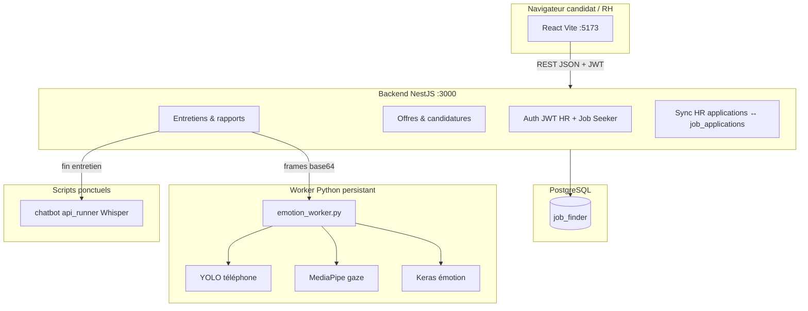

# README Final — Plateforme PFE Job Finder

Guide unique pour cloner le projet depuis GitHub, installer les dépendances, créer la base de données et lancer l'application complète (HR + candidat + IA).

---

## Sommaire

1. [Vue d'ensemble](#1-vue-densemble)
2. [Architecture](#2-architecture)
3. [Structure du dépôt](#3-structure-du-dépôt)
4. [Prérequis](#4-prérequis)
5. [Installation pas à pas](#5-installation-pas-à-pas)
6. [Base de données PostgreSQL](#6-base-de-données-postgresql)
7. [Variables d'environnement](#7-variables-denvironnement)
8. [Démarrage des services](#8-démarrage-des-services)
9. [Flux métier](#9-flux-métier)
10. [API principale](#10-api-principale)
11. [Modules Python (IA)](#11-modules-python-ia)
12. [Optimisations & bonnes pratiques](#12-optimisations--bonnes-pratiques)
13. [Dépannage](#13-dépannage)
14. [Comptes de test](#14-comptes-de-test)

---

## 1. Vue d'ensemble

| Composant | Technologie | Rôle |
|-----------|-------------|------|
| Frontend HR + Candidat | React 18 + Vite | Port **5173** |
| Backend API | NestJS + TypeORM | Port **3000** (`/api`) |
| Base de données | PostgreSQL | Port **8080** (config locale) ou **5432** |
| Chatbot entretien | Python + Whisper | Questions/réponses vocales |
| Détection émotion | Python + Keras + MediaPipe + YOLO | Gaze, émotions, téléphone |

**Pas de Docker** dans cette version : installation locale (Windows recommandé, PowerShell).

---

## 2. Architecture



### Flux entretien candidat (navigateur)

1. RH approuve et planifie → statut `interview_scheduled` (sync côté candidat).
2. Candidat ouvre `/job-seeker/interview/:jobPostingId` → caméra navigateur.
3. Le frontend envoie des images (~toutes les 3 s) à `POST /api/interviews/candidate/:id/emotion-frame`.
4. Le backend lance un **worker Python persistant** (`emotion_worker.py`) — même logique que `interview_monitor.py` (overlay, gaze, phone).
5. À la fin : chatbot (réponses) + rapport HR (scores, émotions, alertes gaze/phone).

---

## 3. Structure du dépôt

```
pfe-main/
├── README.md                 → lien vers ce fichier
├── README_FINAL.md           → ce document
├── start-all.ps1             → démarrage PostgreSQL + backend + frontend
├── scripts/
│   └── init-database.sql     → création base job_finder
├── plateform/jobfinderportal-master/
│   ├── job-finder-backend/   → API NestJS
│   └── job-finder-frontend/  → UI React
├── chatbot/                  → Whisper, entretien vocal
│   ├── .venv/
│   ├── api_runner.py
│   └── requirements.txt
├── emotiondetection/
│   ├── .venv/
│   ├── models/
│   │   ├── emotion_worker.py      → worker API (persistant)
│   │   ├── interview_monitor.py   → test standalone webcam
│   │   └── binary_emotion_model.h5
│   └── requirements.txt
└── face_landmarker.task      → modèle MediaPipe (racine ou chemin env)
```

---

## 4. Prérequis

| Outil | Version min. | Notes |
|-------|--------------|-------|
| **Node.js** | 18+ | Backend + frontend |
| **npm** | 9+ | `npm install --legacy-peer-deps` côté backend si conflits |
| **PostgreSQL** | 13+ | Port **8080** dans `.env.example` du backend |
| **Python** | 3.10+ | venv dans `chatbot/` et `emotiondetection/` |
| **Webcam + micro** | — | Entretien candidat + tests chatbot |
| **Ollama** | optionnel | Uniquement `chatbot/hr_interview.py` interactif |

Espace disque : modèles Python (YOLO, Keras, landmarker) ~500 Mo–1 Go après premier lancement.

---

## 5. Installation pas à pas

### 5.1 Cloner le dépôt

```powershell
git clone <URL_DU_REPO_GITHUB>
cd pfe-main
```

### 5.2 Backend (NestJS)

```powershell
cd plateform\jobfinderportal-master\job-finder-backend
npm install --legacy-peer-deps
copy .env.example .env
# Éditer .env si mot de passe PostgreSQL différent
```

### 5.3 Frontend (React)

```powershell
cd ..\job-finder-frontend
npm install
copy .env.example .env
```

### 5.4 Environnements Python (une fois)

```powershell
cd <racine pfe-main>\chatbot
python -m venv .venv
.\.venv\Scripts\Activate.ps1
pip install -r requirements.txt
deactivate

cd ..\emotiondetection
python -m venv .venv
.\.venv\Scripts\Activate.ps1
pip install -r requirements.txt
deactivate
```

Le backend attend :

- `chatbot\.venv\Scripts\python.exe`
- `emotiondetection\.venv\Scripts\python.exe`

### 5.5 Fichiers modèles

| Fichier | Emplacement |
|---------|-------------|
| `binary_emotion_model.h5` | `emotiondetection/models/` |
| `face_landmarker.task` | racine `pfe-main/` ou variable `FACE_LANDMARKER_PATH` |
| YOLO `yolov8n.pt` | téléchargé automatiquement au premier frame |

---

## 6. Base de données PostgreSQL

### Option A — psql

```powershell
# Se connecter (adapter -p 8080 ou 5432)
psql -U postgres -p 8080 -h localhost

# Puis exécuter :
CREATE DATABASE job_finder;
\q
```

Ou utiliser le script fourni :

```powershell
psql -U postgres -p 8080 -h localhost -f scripts\init-database.sql
```

### Option B — pgAdmin

Créer une base nommée **`job_finder`**, encodage UTF8.

### Tables

En `NODE_ENV=development`, TypeORM **`synchronize: true`** crée/met à jour les tables au démarrage du backend. Aucun script de migration manuel n'est requis pour une installation fraîche.

### Configuration type

| Paramètre | Valeur par défaut (`.env.example`) |
|-----------|-------------------------------------|
| Host | `localhost` |
| Port | **`8080`** |
| User | `postgres` |
| Password | `123` |
| Database | `job_finder` |

Si PostgreSQL écoute sur **5432**, modifier `DB_PORT=5432` dans `job-finder-backend/.env`.

---

## 7. Variables d'environnement

### Backend — `job-finder-backend/.env`

```env
DB_HOST=localhost
DB_PORT=8080
DB_USERNAME=postgres
DB_PASSWORD=123
DB_NAME=job_finder
JWT_SECRET=changez_moi_en_production
PORT=3000
NODE_ENV=development
```

### Frontend — `job-finder-frontend/.env`

```env
VITE_API_BASE_URL=http://localhost:3000/api
```

### Python (optionnel)

```env
EMOTION_MODEL_PATH=emotiondetection/models/binary_emotion_model.h5
FACE_LANDMARKER_PATH=<racine-projet>/face_landmarker.task
```

---

## 8. Démarrage des services

### Méthode rapide (Windows)

À la racine du projet :

```powershell
.\start-all.ps1
```

Ouvre 3 fenêtres : PostgreSQL (si port 8080 libre), backend, frontend.

| Service | URL |
|---------|-----|
| Frontend | http://localhost:5173 |
| API | http://localhost:3000/api |
| PostgreSQL | localhost:**8080** |

### Méthode manuelle

**Terminal 1 — PostgreSQL** (si pas déjà démarré sur le bon port)

**Terminal 2 — Backend**

```powershell
cd plateform\jobfinderportal-master\job-finder-backend
$env:DB_PORT = "8080"
npm run start:dev
```

**Terminal 3 — Frontend**

```powershell
cd plateform\jobfinderportal-master\job-finder-frontend
npm run dev
```

### Vérifier que l'API répond

```powershell
curl http://localhost:3000/api/jobs
```

---

## 9. Flux métier

### RH

1. `/register` → compte HR  
2. `/hr/dashboard` → statistiques  
3. `/hr/jobs` → créer une offre  
4. `/hr/jobs/:id/applicants` → voir candidats, **Approve + Schedule**  
5. Candidat passe l'entretien web  
6. `/hr/reports/:interviewId` → rapport (Q&R, émotion, gaze, phone)  
7. Changer statut (ex. **Rejected**) → reflété chez le candidat (`job_applications`)

### Candidat

1. `/job-seeker/register` → inscription  
2. `/job-seeker/search` → postuler, **My Applications** (rafraîchissement auto)  
3. Lien **Start Interview** quand planifié  
4. `/job-seeker/interview/:jobPostingId` → caméra + monitoring live  

### Mapping statuts HR → candidat

| Statut HR | Statut candidat |
|-----------|-----------------|
| pending | applied |
| reviewed | reviewing |
| shortlisted | shortlisted |
| interview_scheduled | interview_scheduled |
| interview_in_progress | interview_in_progress |
| interview_completed | interview_completed |
| rejected | rejected |
| hired | accepted |

---

## 10. API principale

Préfixe global : **`/api`**

| Méthode | Route | Auth | Description |
|---------|-------|------|-------------|
| POST | `/auth/register` | — | Inscription HR |
| POST | `/auth/login` | — | Login HR (JWT) |
| POST | `/auth/job-seeker/register` | — | Inscription candidat |
| POST | `/auth/job-seeker/login` | — | Login candidat |
| GET | `/jobs` | — | Offres publiques |
| POST | `/job-postings` | HR | Créer offre |
| GET | `/applications/job/:id` | HR | Candidats |
| PATCH | `/applications/:id/status` | HR | Statut + sync candidat |
| POST | `/applications/:id/approve-and-schedule` | HR | Planifier entretien |
| POST | `/interviews/candidate/begin` | Candidat | Démarrer session |
| POST | `/interviews/candidate/:id/emotion-frame` | Candidat | Frame + analyse IA |
| POST | `/interviews/candidate/:id/finish` | Candidat | Fin + rapport |
| GET | `/interviews/:id/report` | HR | Rapport |
| GET | `/job-applications` | Candidat | Mes candidatures |

---

## 11. Modules Python (IA)

### Emotion / gaze / phone (production)

- **Worker** : `emotiondetection/models/emotion_worker.py` (stdin JSON, lancé par NestJS)
- **Standalone** (test webcam locale) :

```powershell
cd emotiondetection
.\.venv\Scripts\Activate.ps1
python models\interview_monitor.py
```

Touches : `Q` quitter, `C` recalibrer le regard.

### Chatbot (Whisper)

- Appelé par le backend en fin d'entretien via `chatbot/api_runner.py`
- **Standalone** (nécessite Ollama pour `hr_interview.py`) :

```powershell
ollama serve
ollama pull llama3
cd chatbot
.\.venv\Scripts\Activate.ps1
python hr_interview.py
```

---

## 12. Optimisations & bonnes pratiques

- **Worker Python persistant** : évite de recharger YOLO/MediaPipe à chaque frame (vs ancien subprocess par image).
- **Frames candidat** : envoi ~3 s (équilibre charge réseau / réactivité gaze).
- **Sync statuts** : à chaque `PATCH` HR + resync à la lecture des candidatures candidat (requête groupée côté API).
- **Preview annotée** : le backend renvoie `previewBase64` (même rendu que le moniteur Python).
- **Production** : désactiver `synchronize: true`, utiliser migrations TypeORM, changer `JWT_SECRET`, HTTPS.

Fichiers à ne **pas** committer (déjà dans `.gitignore`) : `.env`, `node_modules/`, `.venv/`, `.runtime/`.

---

## 13. Dépannage

| Problème | Solution |
|----------|----------|
| `EADDRINUSE :::3000` | `Get-NetTCPConnection -LocalPort 3000` puis arrêter le PID, relancer le backend |
| `Cannot connect to PostgreSQL` | Vérifier service PostgreSQL, `DB_PORT`, base `job_finder` créée |
| `Cannot POST /api/interviews/candidate/...` | Backend pas à jour ou pas redémarré |
| Rapport 0 frames / 0% | venv Python manquant, erreur worker → logs terminal backend |
| Gaze ne réagit pas | Regarder la caméra pendant calibration **(15 frames)** ; vérifier `face_landmarker.task` |
| Premier frame très lent | Téléchargement/chargement YOLO (normal, 30–60 s) |
| Statut candidat pas à jour | Rafraîchir onglet Applications ; vérifier email identique HR/candidat |
| `npm install` ERESOLVE | `npm install --legacy-peer-deps` dans le backend |

---

## 14. Comptes de test

Aucun compte par défaut : créer un HR et un candidat via l'interface.

**Recette rapide**

1. HR : créer offre → candidat postule → HR approuve + planifie  
2. Candidat : entretien (caméra, attendre calibration, tester regard/téléphone)  
3. HR : rapport + passer en Rejected → candidat voit **Rejected**  

---

## Licence & crédits

Projet de fin d'études (PFE) — plateforme RH avec modules IA intégrés.

Pour toute question technique, se référer uniquement à **ce fichier** et au code source ; les anciens guides (`CURSOR_INSTRUCTIONS`, README dispersés) ont été retirés du dépôt.
